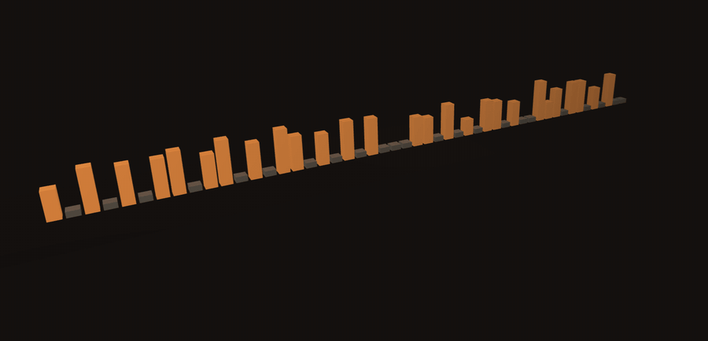
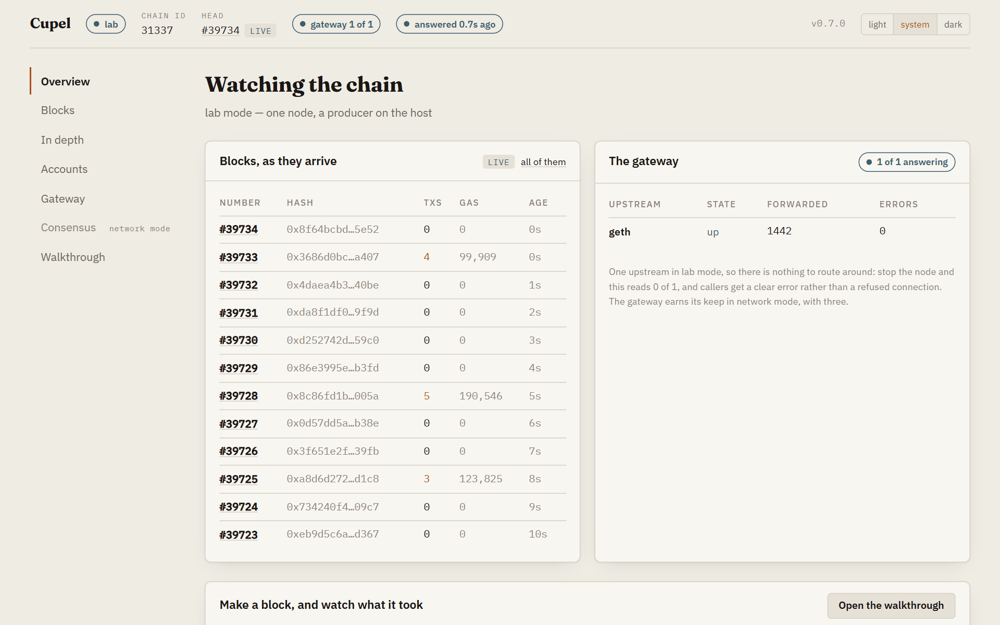
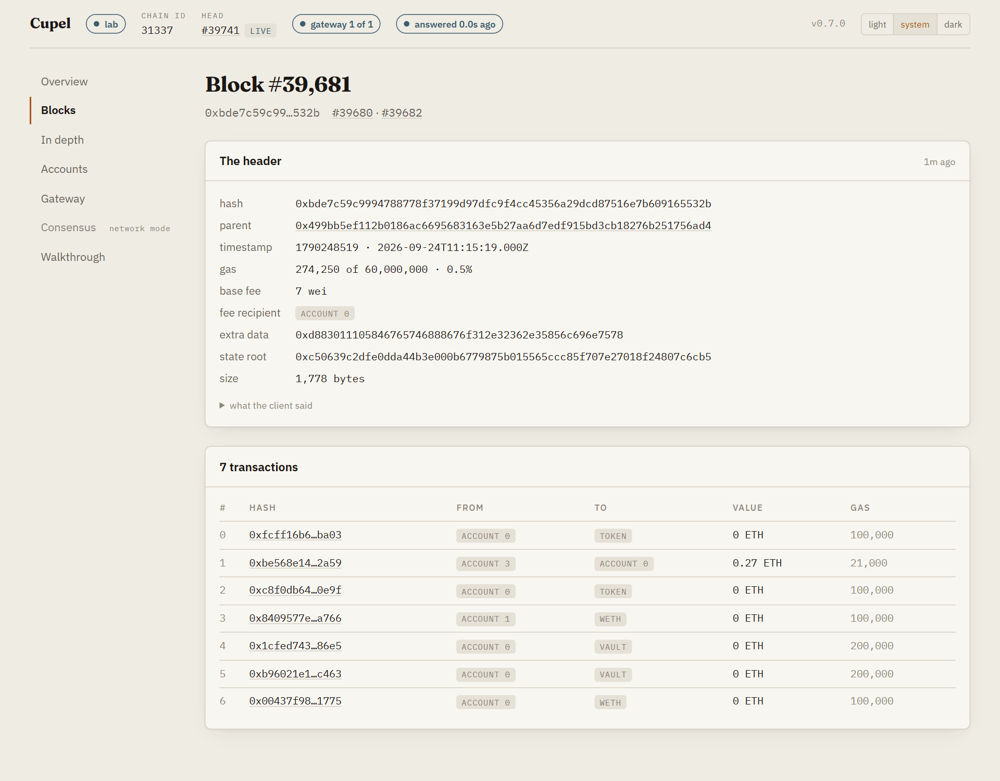
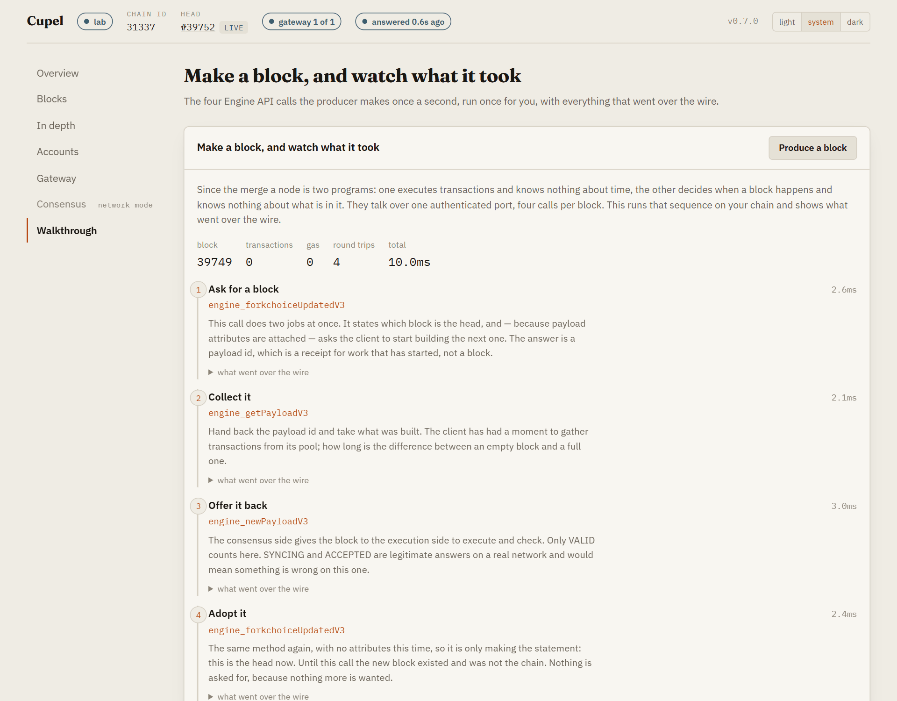
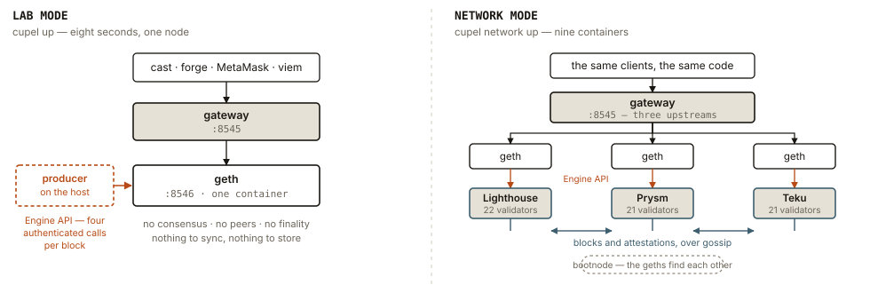
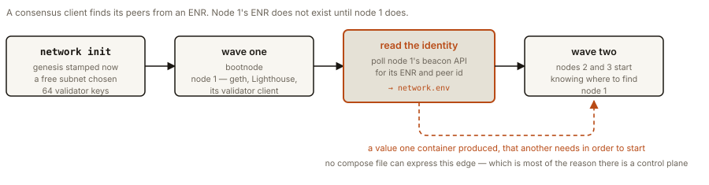

# Cupel

**A local Ethereum laboratory — the machinery, with the lid off.**



<sub>A lab chain under <code>cupel traffic</code>, drawn by the control room: one box per block, as tall as the gas it used.</sub>

Ethereum is two peer-to-peer networks, a handful of ports and an authenticated
handshake between two programs that do not trust each other. You can read about
that. You cannot normally *watch* it, because every network that runs it is
either too large to see or too simplified to be real.

Cupel gives you both. One command gives you a working chain in about eight
seconds — no sync, no download — with annotated reference contracts already
deployed, a gateway in front of it and dashboards behind it. A second command
gives you a **real network**: three execution clients paired with Lighthouse,
Prysm and Teku, sixty-four validators, a discovery bootnode, and a chain that
genuinely reaches finality. Same contracts, same addresses, running on a laptop.

Both open a **control room** in the browser: the head of the chain, the blocks
as they arrive and what was in them, the accounts and the contracts, whether
the three clients agree on what is final — and a button that makes a block and
shows you the four calls that made it, with the real requests, the real answers
and the real timings.

> A **cupel** is the porous bone-ash vessel used in fire assay. You heat an alloy
> inside it; the base metals oxidise into the walls, and what remains is the pure
> metal. It is the tool for finding out what something is really made of.

---

## The idea

Since the merge, an Ethereum node is two programs. One executes transactions and
knows nothing about time; the other decides when a block happens and knows
nothing about what is in it. They talk over a single authenticated port, four
calls per block, and that conversation is the hinge the whole network turns on.

Almost nobody has seen it. On mainnet it is buried under a terabyte of history
and a thousand peers. In a development node it does not happen at all — Anvil
and Hardhat skip consensus entirely, which is the right trade for a unit test
and useless for understanding what a chain *is*.

Cupel exists to make that machinery visible and small enough to hold:

- **Watch a block being made.** Four Engine API calls, authenticated with a
  shared secret, one of them carrying the payload the execution client just
  built. In lab mode the thing making those calls is 500 lines you can read.
- **Watch consensus happen.** Slots, epochs, attestations, justification,
  finality — as numbers that move, on a chain small enough that every validator
  is yours.
- **Watch three implementations agree.** Lighthouse, Prysm and Teku, written by
  different teams in different languages, arriving at the same finalised block.
  Client diversity stops being a slogan when you can print all three answers.
- **Watch a network form.** Nodes told only where a bootnode is, discovering each
  other, gossiping blocks and attestations.
- **Read the contracts, then call them.** ERC-20 with permits, ERC-4626, WETH —
  annotated implementations at fixed addresses, so a standard becomes something
  you invoke rather than something you skim.

Every tool nearby is built for a different job:

| | Built for | Why it isn't this |
|---|---|---|
| **Anvil · Hardhat Node** | Fast unit tests | One node, no consensus — the interesting half is missing |
| **Kurtosis** | Client teams testing *clients* | A test harness, not a place to learn from |
| **eth-docker · Sedge** | Staking operations | Points at mainnet; nothing to take apart |
| **Blockscout · Otterscan** | Viewing a chain | A component to integrate, not a stack |

Nobody packages a chain as a **laboratory** — somewhere the parts are exposed on
purpose, and the point is understanding rather than throughput. That is the whole
project.

---

## Try it

A [release](https://github.com/Azizzzss/cupel/releases) is one binary that
carries the rest. The compose files and the configuration are inside it, and it
writes them out the first time it runs, so the download is the whole thing.
Docker still has to be running, because the chain does.

From a checkout instead:

```bash
cargo run -p cupel --release
```

```
  Cupel v0.6.0
  ---------------------------------------------------
  RPC          http://127.0.0.1:8545
  Control room http://127.0.0.1:8544
  Node         http://127.0.0.1:8546 (behind the gateway)
  Metrics      http://127.0.0.1:8545/metrics
  Signer       http://127.0.0.1:8550  (policy at /policy, decisions at /audit)
  Chain id     31337
  Block time   1s

  Accounts (10000 ETH each)
  (0) 0xf39Fd6e51aad88F6F4ce6aB8827279cffFb92266
      0xac0974bec39a17e36ba4a6b4d238ff944bacb478cbed5efcae784d7bf4f2ff80
  ...

  Contracts
  Token  0x00000000000000000000000000000000c0de0020
  Vault  0x00000000000000000000000000000000c0de4626
  Weth   0x00000000000000000000000000000000c0de0009

  Producing blocks. Ctrl-C to stop.
```

Point `cast`, `forge`, MetaMask or `viem` at `127.0.0.1:8545` and work.

```bash
cast call 0x00000000000000000000000000000000c0de0020 'name()(string)'   # "Cupel Token"
cast send 0x00000000000000000000000000000000c0de0020 'mint(address,uint256)' $YOU 1000e18
```

MetaMask connects at chain id **31337**; import any key above.

A chain nobody uses makes empty blocks. To see one that is busy, leave this
running in a second terminal:

```bash
cupel traffic
```

```
  #0  n12    Vault.deposit, 78 CUP
  #3  n3     Token.transfer → #2, 4 CUP  — skips nonce 2
            accepted, and parked in `queued`: nothing from #3 can run until nonce 2 arrives
  #0  n13    Vault.deposit of nothing — refused, reverts on purpose
            it will still be mined, and still pay for the gas it burns — a revert undoes effects, not inclusion
  #1  n2     Token.transfer → #3, 46 CUP
  #3  n2     Weth.deposit, 0.07 ETH  — fills the gap
            nonce 2 is here, so 3 can run: both leave `queued` together
```

Payments, mints, transfers, vault deposits and redemptions and wrapped ether,
from three accounts, in bursts. The occasional revert and nonce gap are on
purpose; `--clean` leaves them out.

---

## The control room

The banner prints a second address. Open it.

<picture>
  <source media="(prefers-color-scheme: dark)" srcset="docs/img/control-room-overview-dark.png">
  
</picture>

A strip across the top that never scrolls away — mode, chain id, the head as it
ticks, where the clock is in network mode, whether the gateway has upstreams,
and how old the oldest answer on the page is — and pages down the side, every
one of them reading from the chain rather than from anything this process
remembers:

| | |
|---|---|
| **Overview** | the blocks as they arrive, the gateway, and in network mode the agreement table and the clock |
| **Blocks** | the recent window, fifty at a time and five hundred at most. Every number opens the block — the header as the client sent it, the transactions in full — and every transaction opens what was sent, what it cost, what happened, and the events the genesis contracts logged, decoded by name |
| **Pool** | what the node has accepted and not yet put in a block: pending (ready), queued (parked behind a nonce gap, with the nonce it waits for), and what just left and how long it stayed. In network mode, each node's own count — there is no network-wide pool |
| **In depth** | the same window as a solid object: one box per block, as tall as the gas it used. Point at one for its number, click to open it |
| **Accounts** | the four development accounts with live balances and nonces, and the three contracts with their names, symbols and supplies read by `eth_call` |
| **Gateway** | how many upstreams are answering, and what each has forwarded |
| **Consensus** | network mode: what Lighthouse, Prysm and Teku each call the head, the justified epoch and the finalised one, and whether they agree |
| **Walkthrough** | lab mode: the button that makes a block and shows the four calls that made it |

Two things this page does that a dashboard usually does not.

**It says when a number stopped being true.** A panel keeps the last thing a
source said, because a panel that blanks on one failed request is one nobody
trusts — and once that answer is older than three intervals it greys and says
"last answer 12s ago, showing what was true then". Stop geth and the page does
not go on looking like a chain making blocks. The strip judges the page from
its worst source.

**It hears about blocks rather than asking.** geth publishes a WebSocket and
the beacon nodes an event stream, and the page subscribes: `newHeads` rings,
and the head is fetched over HTTP the moment it exists — in lab mode through
the gateway, so the gateway's counters keep meaning something. The socket is a
doorbell, not a data path. Polling never stops while it is open; it stretches,
so a dead-but-open socket cannot freeze the page. Each panel says which it is
getting, "live" or "polling".

The agreement panel distinguishes several outcomes, not two. A client that
cannot be reached, a chain that has not finalised anything yet, a client that is
merely *behind* by some number of epochs, and a client that actually
**disagrees** at the same epoch are different situations, and only the last one
is alarming. Collapsing them into "agree / disagree" is how a syncing node gets
reported as a consensus failure. A node whose last answer is too old counts as
not answering — never as a silent vote for whichever root it last reported.

The blocks pages are bounded on purpose. Fifty arrive on their own, fifty more
come on request, and the page stops at five hundred and says so: this is the
recent window, not an explorer. An explorer indexes; this asks. The explorer is
phase G.

<picture>
  <source media="(prefers-color-scheme: dark)" srcset="docs/img/control-room-block-dark.png">
  
</picture>

**One page is a picture.** *In depth* draws the same window as a solid object:
a lane running away from the camera in the order the blocks were made, each box
as tall as the gas its block used, orange where it carried transactions and grey
where it was empty. Point at one and it names itself — number, transactions, gas
— and clicking opens it. In network mode a marker floats above the block each
client calls the head.

Nothing in it is ornament. The length is the window, the heights are gas, the
colour is whether anything was in it, and the markers are what the clients
answered. A height has to mean the same thing twice, so the scale climbs in
round steps and the legend prints the number it has reached: scaled straight to
the busiest block in view, every box grows the moment that block falls off the
end of a window that moves every second, and a block that has not changed
appears to have.

It refuses two things. A client whose head is outside the window is drawn at the
end of the lane and named as ahead or behind, never placed on a block this page
never fetched. And the scene does not take the wheel until you have taken hold
of it, because a canvas two thirds of the window tall that swallows scrolling is
a trap with nothing on screen to explain it.

And it stops drawing when nobody can see it. A browser pauses a background tab
on its own, but not a canvas scrolled out of view while you read the legend
under it, and sixty frames a second of that is a laptop fan. Hidden or off
screen, the scene draws nothing; with reduced motion asked for, it draws only
when a block arrives or you move it.

three.js is larger than the rest of this interface put together, so that page is
fetched on its own: the main bundle stays where it was and the scene is a
separate chunk, which only a reader who opens it pays to parse. The binary
carries both either way, and says so in what it weighs.

Then there is a button that makes a block. It runs the same four Engine API
calls the producer runs once a second, with a copy kept of everything sent and
received, and lays them out in order with what each one is for:

```
  1  engine_forkchoiceUpdatedV3   2.1ms   payloadId 0x03a35bad9e60fdc1
  2  engine_getPayloadV3          1.4ms   block 1001, 0 txs
  3  engine_newPayloadV3          0.8ms   VALID
  4  engine_forkchoiceUpdatedV3   0.3ms   VALID
```

`forkchoiceUpdated` appears twice and the two calls do different jobs — the
first asks for a block, the last accepts one — so the explanations are keyed by
method *and* occurrence rather than by position.

<picture>
  <source media="(prefers-color-scheme: dark)" srcset="docs/img/control-room-walkthrough-dark.png">
  
</picture>

Everything on the page except that button is read straight from the clients by
the browser. The button is the exception: making a block means an authenticated
call to the Engine API with a shared secret, over a port bound to localhost.
That is this process's job, so `POST /api/produce` is behind the page, and it
holds the head under a lock for the whole four-call sequence — each of those
calls names the parent, so two producers working from one head would have the
second building on a block the first had already replaced. The only other
endpoint is `GET /api/mode`: which mode this process is running and which
version it is, the one thing only the process knows.

Pages are hash routes — `#/block/1234` — because the bundle refers to its assets
relatively so the binary can mount it anywhere, and a path with a second
segment would resolve them under `/block/`. Every address the page names — the
four accounts and the three contracts — is mirrored from the Rust side, and a
Rust test reads the TypeScript to check the two agree.

The page is React and Vite, built to `ui/dist` and compiled into the binary with
`rust-embed`. The bundle is committed, which is what lets `cargo build` and all
four release targets produce a working control room with no JavaScript toolchain
anywhere near them — the same trade the contracts make by committing bytecode
into genesis. CI lints it, type-checks it, runs its tests, rebuilds it from
source on every push and fails if the result differs from what is committed,
because a build output kept in a repository becomes a lie the moment its source
moves without it.

The typefaces travel with it, for the same reason. The page used to fetch IBM
Plex and Fraunces from Google, so the design it was written to have appeared
only on a machine with internet — and a laptop with no network is most of the
point of this project. Offline, every heading fell back to Georgia and nothing
said so. Six woff2 files, latin only, are compiled in beside the bundle, and a
test asserts that the page names no font host and that each file is served as
`font/woff2`: a woff2 handed over as `application/octet-stream` is one a browser
declines to use, and that failure looks exactly like never having shipped
them.

---

## Walkthroughs

The parts above are the apparatus. These are the way in — numbered lessons that
do real work against a running chain and narrate it as they go.

```bash
cupel lab        # what there is
cupel lab 1      # run the first one
```

| | | needs |
|---|---|---|
| **1** | How a block is made | `cupel up` |
| **2** | Where a transaction waits | `cupel up` |
| **3** | Slots, epochs and finality | `cupel network up` |
| **4** | Three clients, one chain | `cupel network up` |

Nothing is simulated and nothing is pre-recorded. Walkthrough 1 produces a real
block on your chain and prints the four calls that did it, with the real payload
id and the real timings:

```
  -- 1. Ask for a block --

  `engine_forkchoiceUpdatedV3` does two jobs at once. It states which block is
  the head, and — when payload attributes are attached — asks the client to
  start building the next one. The client answers with a payload id, which is a
  receipt for work it has started, not a block.

      Method                 engine_forkchoiceUpdatedV3
      Sent                   [{finalizedBlockHash, headBlockHash, safeBlockHash},
                              {parentBeaconBlockRoot, prevRandao,
                               suggestedFeeRecipient, timestamp, withdrawals}]
      Answered in            2.1ms
        payloadStatus.status VALID
        payloadId            0x03a35bad9e60fdc1
```

That is the same producer `cupel up` runs, asked to keep a copy of what it sent.
There is one implementation of how a block gets made and it narrates itself,
rather than a second copy of the sequence living next to a lesson about it and
quietly drifting.

The consequence is that a walkthrough run against a chain that is not up
**fails**, rather than printing a plausible transcript. That is the point: you
are watching the machine, not a description of it.

The prose lives in [`crates/cupel/src/lab.rs`](crates/cupel/src/lab.rs), beside
the code that produces the output — a lesson kept in a separate document drifts
from what it describes and nothing catches it.

---

## What's in the box

| | | Written here |
|---|---|---|
| **Control plane** | `cupel up` and `cupel network up` — two modes, health-gated startup, clean teardown | ✅ |
| **Block producer** | Drives geth over the Engine API, because geth cannot make blocks alone | ✅ |
| **Devnet orchestration** | Genesis stamped at start-up, a subnet chosen from what is free, and nodes 2 and 3 started with an identity node 1 did not have until it was running | ✅ |
| **Contract library** | Annotated ERC-20/Permit, ERC-4626, WETH, deployed in genesis | ✅ |
| **RPC gateway** | Capability routing, health, failover, caching, metrics | ✅ |
| **Policy signer** | A held key behind ceilings, allowlists and budgets, with an audit log | ✅ |
| **Control room** | Blocks as they arrive and what was in them, accounts and contracts, gateway health, client agreement, a clock in the chain's own units, and an Engine API walkthrough that produces real blocks — pushed by the nodes, and honest about when a number stopped being true | ✅ |
| Execution client | geth | integrated |
| Consensus clients | Lighthouse, Prysm, Teku — one each, on purpose | integrated |
| Genesis and keys | ethPandaOps' generator, pinned | integrated |
| Monitoring | Prometheus, Grafana | integrated |
| Signing primitives | `alloy` | integrated |

The line matters: a project that is only compose files and Grafana JSON reads as
configuration, not engineering. Cupel writes the parts that decide how the lab
behaves and integrates the parts already better solved. The devnet is the
clearest case of both at once — the clients and the genesis are somebody else's
work, and everything about *when* and *in what order* they start is not, because
a compose file cannot wait on a value one of its own containers produces.

---

## The contract library

Three contracts exist at block zero, at addresses whose last digits name the
standard they implement. They are there so a standard is something you can call
rather than something you read about — `cast call` a real ERC-20 and read the
event it emits, on a chain where you own every account:

| | Address | |
|---|---|---|
| `Token` | `0x…c0de0020` | ERC-20 with EIP-2612 permits. Anyone may mint, so you always have supply. |
| `Vault` | `0x…c0de4626` | ERC-4626 over `Token` — deposits, shares, and the rounding between them. |
| `Weth` | `0x…c0de0009` | Wrapped ether: the contract that turns the native asset into a token. |

**They are not deployed by a transaction.** Their runtime bytecode is written
into the genesis file, so they exist before the first block, at addresses fixed
in advance, with nothing to run first and nothing that can fail halfway. The cost
is that constructors never execute, so every contract is written to need no
constructor state — supply starts at zero, the vault's asset is a constant, and
the EIP-712 domain separator is computed per call rather than cached. That last
one is better anyway: a cached separator is wrong on any other chain the code is
later placed on.

[The tests](contracts/test) exist to show the standards behaving, including in
the places the specification is easy to read past:

- **What an allowance actually is.** Not a promise about a total — a number the
  spender may draw down at any moment. Change one from 100 to 50 and a spender
  who moves between the two transactions draws **150**, because there was never a
  moment when the token was in an inconsistent state. This is why ERC-20 grew a
  `zero it first` convention and why `increaseAllowance` exists.
- **How a vault converts between assets and shares.** ERC-4626 is a ratio, and a
  ratio in integer arithmetic has to round somewhere. Deposit into an empty vault
  and into a vault someone has donated to, and watch the same deposit buy
  different numbers of shares — then watch what rounding down does to the
  redemption.
- **What an EIP-712 signature is bound to.** A permit carries a nonce so it
  cannot be replayed, a deadline so it expires, and a domain that names the chain
  id — so a signature made here is meaningless anywhere else. Each is tested by
  trying it.
- **Infinite allowance, burn semantics, and the two reverts** every ERC-20 has to
  produce.

```bash
cd contracts && forge test
```

No submodules and no network fetch — the cheatcode interface is declared
locally, so a fresh clone tests with nothing installed.

To change a contract: edit, `forge build`, `cupel genesis`, `cupel reset`. The
generated genesis is committed, so a clone needs Solidity only to *change* a
contract, not to run one.

---

## The gateway

Everything points at `8545`; the gateway points at the nodes.

**Routing is by capability, not just liveness.** Each upstream declares whether
it keeps history, serves `debug_`/`trace_`, and serves `txpool_`. Resolution is
capability → health → weight. Capability first, so a request nothing can serve
gets one clear error rather than a confusing failure from a node that was never a
candidate. Whether a call needs history is judged from its *arguments*:
`eth_getBalance` at `latest` asks for nothing special, the same call at block
`0x5` needs an archive node.

**A node that stops answering leaves the rotation and returns on its own.**

```bash
docker stop cupel-geth
curl -s localhost:8545/health     # 503, up: false
# {"error":{"code":-32003,"message":"no healthy upstream is available"}}
docker start cupel-geth           # health recovers by itself
```

Two consecutive failed probes take a node out — one is usually a blip, and
removing on the first makes a gateway flap under load. A failed *request* counts
as evidence too, so a node dying between probes is noticed at once. The chain
keeps running through all of it: block production reports the stall, retries,
re-reads the head, and resumes.

**Only provably immutable answers are cached.** A block identified by hash cannot
change; a block identified by `latest` changes every second. Narrow by design —
getting this wrong does not look like a slow gateway, it looks like a client
being told something false.

**Expensive methods have their own rate limit.** `eth_call`, gas estimation, log
queries and tracing cost a node far more than a balance lookup, and a loop
issuing them is the usual way a local node becomes unresponsive.

---

## Network mode

Lab mode is one node told what to do by a producer on the host. That is the
right trade when you want a chain *now*, and the wrong one when the question is
about the network itself. The difference is where blocks come from:

<picture>
  <source media="(prefers-color-scheme: dark)" srcset="docs/img/two-modes-dark.svg">
  
</picture>

`cupel network up` builds the second one:

```bash
cupel network up
```

```
  Cupel network v0.6.0
  ---------------------------------------------------
  node1   Lighthouse  rpc http://127.0.0.1:8555  beacon http://127.0.0.1:5052
  node2   Prysm       rpc http://127.0.0.1:8556  beacon http://127.0.0.1:5152
  node3   Teku        rpc http://127.0.0.1:8557  beacon http://127.0.0.1:5252

  Chain id     31337, 64 validators, 12s slots, Electra
  Finality     four epochs of 32 slots — about 25 minutes from genesis
  Contracts    the same addresses as lab mode
```

Nine containers: a discovery bootnode, three geth nodes, three different
consensus clients, and the validator clients driving them. Sixty-four validators
split 22/21/21, so **no single node can finalise the chain alone** — more than
two thirds of the stake has to agree, and that means at least two of the three
clients agreeing, in production code, about a chain they each built
independently.

The same arithmetic has a second edge, and it is sharper than it looks: *which*
node you stop decides what happens. Finality needs more than two thirds — 43 of
64. Stop node1 and 42 remain, so the chain keeps producing blocks and stops
finalising, resuming the moment the node is back. Stop node2 or node3 and 43
remain, a tenth of a percent above the line, and finality carries on untroubled.

The split is uneven because sixty-four does not divide by three, and that is the
lesson rather than a detail: the threshold counts validators, not nodes.

```bash
cupel network status
```

```
  node    consensus     block   slot   justified   finalized   peers
  --------------------------------------------------------------------
  node1   Lighthouse      147    151           3           2       2
  node2   Prysm           147    151           3           2       1
  node3   Teku            147    151           3           2       1
```

Three clients, three sets of numbers, and they match. That is the whole point of
the mode: not that a chain runs, but that independent implementations agree
about what it contains.

**A note on what "it works" looks like.** Getting three clients onto one chain
took three separate peering fixes, and all three failed the same way: silently.

Teku found nobody through discovery. Prysm, handed a TCP address to fix that,
dialled it instead of finding its peer over QUIC — and the connection
half-opened, so node 1 listed Prysm as connected while Prysm counted no peers at
all. Teku, given the same TCP address, connected properly and received gossip
perfectly, but never joined the gossip mesh, so every message it tried to publish
went nowhere.

The last one was not a peering fix at all. Cupel generated its chain at the tip
of the fork schedule because the generator defaults there, which meant Fulu, and
Fulu splits blob data across a hundred and twenty-eight column subnets. Three
nodes cannot cover that between them, so each had to custody everything and
subscribe to about two hundred gossip topics — and at that size the subscription
exchange between clients stopped working. Teku published nothing at all:
seventeen proposed blocks, seventeen failures, and its twenty-one validators
attesting into the void. **The devnet targets Electra**, and Teku's failed
publishes went to zero. A lab should run the fork its clients agree on, not the
newest one.

Every time, blocks propagated — no client ever disagreed about a block it had —
because a block only has to reach the network once and one peer is enough for
that. Attestations need a gossip mesh. So the chain looked healthy and simply
never justified, and the only signal was a number that stayed at zero. That is
why `cupel network status` shows justification, finality and peer count beside
the block height, rather than reporting that the nodes are up.

`cupel observe` brings up a dashboard for this mode. The panel that
matters is **Clients disagreeing** — the gap between the furthest-ahead and
furthest-behind client, which should read zero for ever. Beside it, three head
slot lines drawn exactly on top of one another.

**Everything else still works.** Same chain id, same four funded accounts, and
the same three contracts at the same addresses — the bytecode is lifted from the
committed lab genesis rather than recompiled, so the two modes are provably
carrying the same code:

```bash
cast call 0x00000000000000000000000000000000c0de0020 'name()(string)' \
  --rpc-url http://127.0.0.1:8555      # "Cupel Token"
```

### What is generated, and what is written here

Genesis, validator keys and the beacon chain's initial state come from
[ethPandaOps' generator](https://github.com/ethpandaops/ethereum-genesis-generator),
pinned to a version. What Cupel writes is the orchestration around it, because
a devnet has two dependencies a compose file cannot express:

**Genesis must be stamped with the current time.** Left at the generator's
default the chain begins at the Unix epoch, and every client spends its first
minutes walking three hundred million empty slots. So genesis is generated at
start-up — but only when there is no chain to resume. A chain that has already
run must keep the genesis it started from, and the data volumes are what decide
which case this is. `cupel network down` then `cupel network up` therefore comes
back to the same chain, at the height it left off, with the same finalised root.

**Nodes 2 and 3 cannot start until node 1 exists.** A consensus client finds its
peers from an ENR, and node 1's ENR does not exist until node 1 is running. So
`network up` starts the first wave, polls the beacon API for node 1's identity,
writes it into the environment, and only then starts the rest. That handoff is
most of the reason there is a control plane here rather than a third compose
file.

<picture>
  <source media="(prefers-color-scheme: dark)" srcset="docs/img/startup-dark.svg">
  
</picture>

**The subnet is chosen, not fixed.** A hard-coded `172.20.0.0/24` fails the
moment another project on the machine has taken it, with a Docker error that
names no culprit. `network init` reads what Docker has already allocated and
picks a free one — skipping the range Docker hands out itself, and the range WSL
uses for its own interface, since claiming that one cuts the host off from its
network in order to run a devnet.

---

## Policy signing

Clients sign for themselves. The signer on `:8550` is for the other case: an
*application* that must send transactions, and therefore needs a key it cannot be
trusted with. The faucet is exactly that shape.

A policy turns *"this process was compromised"* into *"this process was
compromised and could still only send one ether to two known addresses before the
rate limit stopped it"*.

```bash
curl -s localhost:8550/policy    # what the key is held under
curl -s localhost:8550/audit     # what it has decided lately
```

```
value 100000000000000000000 exceeds the ceiling of 1000000000000000000 wei
this key may not deploy contracts
no key held for 0xf39Fd6e51aad88F6F4ce6aB8827279cffFb92266
rate limit reached: 10 signatures per 60s
```

The rules are a per-transaction value ceiling, a gas ceiling, an optional
recipient allowlist, a blocklist that beats it, whether the key may deploy at
all, and both a **count and a spending budget** per window — a rate limit alone
still permits ten transactions of the maximum size, and the budget is what bounds
the total. It counts what a transaction can cost the key, not only what it sends:
its value, plus its whole gas limit at its maximum fee.

Nonce and gas are required, as they are for geth's own `eth_signTransaction`: the
signer does not read the chain, and the defaults they would otherwise need — a
nonce of 0, a 21000 gas limit — are each wrong in a way that looks right.

**Every decision is recorded, approvals included.** A log holding only refusals
answers "what was blocked", and the question after an incident is always "what
was signed". Entries are one JSON object per line in `data/audit.log`, opened in
append mode so a restart cannot truncate the history.

A refused request does not consume the budget, or a flood of rejected requests
becomes a way to deny service to legitimate ones.

> **Why not Clef?** It was the obvious thing to integrate, and it no longer
> exists — `cmd/clef` has been removed from go-ethereum and the binary is absent
> from the `alltools` image, though [the documentation
> page](https://geth.ethereum.org/docs/tools/clef/introduction) still describes
> it as current (last edited December 2022). Rather than pin an ancient geth to
> run a deleted tool, the policy engine is implemented here and the signing
> primitives come from `alloy`: borrow the cryptography, own the rules.

---

## Monitoring

```bash
cupel observe          # Prometheus and Grafana, provisioned, no login
cupel observe --down
```

Grafana on `:3000` comes up with three dashboards already wired.

**Cupel — gateway** is about lab mode: upstreams answering, request rate split
ok/failed/rejected, cache hit ratio, health over time, traffic by method.
Metrics come from the gateway rather than from geth, deliberately — what matters
in a lab is what clients experienced, not what the node thinks of itself.

**Cupel — execution** is the other half of that sentence: what the node thinks
of itself, in either mode. Head with the safe and finalised markers trailing it,
the transaction pool, Engine API latency and call rate, JSON-RPC, peers, state
cache, disk. The panel worth knowing about is **Transactions geth refused**,
because it is the only place the lab's most expensive silence is written down: a
transaction paying less than `--miner.gasprice` is accepted into the pool,
returns a hash, and is then skipped by the payload builder for ever. No error,
no log line — just a transaction pending while empty blocks keep coming, and
`txpool_underpriced` climbing.

**Cupel — network** is about the devnet, where the node's own view *is* the
point: finalised epoch, head slot per consensus client, justification, peers on
both layers, and the gap between the furthest-ahead and furthest-behind client.

These are written here rather than imported, for a reason worth stating. Both
well-known community geth dashboards fail against this stack: the one forked
from EF devops is InfluxDB-only and was last revised in 2021, so its central
panels — `chain_execution`, `chain_validation`, `chain_write`, `trie_memcache_*`
— plot metrics geth 1.17 no longer emits; the other needs a JSON-RPC exporter
last touched in 2019, before the merge. Neither would report an error. Both
would simply draw empty boxes, which on a lab chain is indistinguishable from a
quiet one. That is why CI asks a live Prometheus for every panel's query and
fails on any that returns no series
([`check-dashboards.sh`](.github/scripts/check-dashboards.sh)).

Two details that cost time. geth does not serve Prometheus at `/metrics` — it
serves expvar there and the text format at `/debug/metrics/prometheus`, so the
wrong path gives a target that answers, scrapes clean and yields nothing. And
the three consensus clients agree on `beacon_head_slot` and
`beacon_finalized_epoch` but not on what to call a peer count, or on what
counts as one: Prysm can report zero peers while it is demonstrably gossiping.
The panel shows each client as it sees itself, because smoothing that over would
hide exactly the kind of difference this mode exists to surface.

---

## Commands

| | |
|---|---|
| `cupel up` | start the chain and produce blocks until Ctrl-C |
| `cupel up --block-time 5` | slower blocks |
| `cupel up --keep` | leave the container running after exit |
| `cupel up --bind 0.0.0.0` | serve the gateway off localhost — needed for metrics on plain Linux Docker |
| `cupel down` | stop the chain, keep its data |
| `cupel reset` | stop the chain and delete its data |
| `cupel status` | is it up, and where has it got to |
| `cupel lab` | list the walkthroughs |
| `cupel lab 1` | run one — real work against a running chain, narrated |
| `cupel traffic` | send real transactions in bursts until Ctrl-C, so blocks carry something |
| `cupel traffic --clean --duration 60` | only transactions meant to succeed, for a minute; fails if any did not |
| `cupel contracts` | list the reference contracts and their addresses |
| `cupel genesis` | rewrite the genesis allocation from the compiled contracts |
| `cupel observe` | start Prometheus and Grafana against the gateway and the nodes |
| `cupel network up` | build and start the three-client devnet |
| `cupel network status` | ask all three nodes where the chain has got to |
| `cupel network down` | stop the devnet, keep its chains — `up` resumes it |
| `cupel network reset` | stop the devnet and delete its chains |
| `cupel network init` | regenerate genesis and keys without starting anything |

### Ports

| | |
|---|---|
| `8544` | **the control room** |
| `8545` | **the gateway** — the only RPC anything should point at |
| `8546` | geth's own JSON-RPC, behind it |
| `8547` | geth's WebSocket, for the control room's `newHeads` subscription |
| `8550` | the policy signer |
| `8551` | Engine API, JWT authenticated, localhost only |
| `6060` | geth's metrics, for Prometheus |
| `3000` / `9090` | Grafana / Prometheus, when `cupel observe` is running |

Network mode uses its own ports, so both modes can run at once:

| | |
|---|---|
| `8555` / `8556` / `8557` | the three execution clients' JSON-RPC |
| `8558` / `8559` / `8560` | the three execution clients' WebSockets |
| `5052` / `5152` / `5252` | the three beacon APIs |
| `6061`–`6063`, `6071`–`6073` | execution and consensus metrics, for Prometheus |

---

## Requirements

- **Docker**, with the daemon running
- **Rust** 1.91 or newer, to build it — a release binary needs none
- **Foundry**, only to change a contract — not to run one

```bash
cargo test --workspace          # 118 tests
cd contracts && forge test      # 15 tests
```

---

## Design notes

The things that were not obvious, and cost time to find out.

**Lab mode has no history, and that is the point.** A node joining mainnet must
download and verify ~1.2 TB before it can answer anything. Cupel creates a chain
at block zero instead — nothing to sync, nothing to store, usable in seconds. The
trade is that the chain is empty: no Uniswap, no USDC, no mainnet state.

**Geth cannot make blocks on its own.** Since the merge it will accept
transactions, gossip them and answer queries, then sit at the same block for
ever, because deciding *when* a block happens is the consensus layer's job.
Clique has been deprecated since v1.14 and removed. Running a full beacon client
to get one block a second in a lab is disproportionate, so Cupel ships [its own
block producer](crates/producer) — four authenticated Engine API calls per block.
It is a **block producer, not a consensus client**: no attestations, no fork
choice, no real finality.

**`--miner.gasprice` decides whether anything is mined at all, and it fails
silently.** Geth's payload builder drops any transaction offering a smaller tip,
so the transaction is accepted into the pool, reported as pending, and never
included — blocks keep coming, all of them empty, and nothing anywhere reports an
error. Worse, geth *refuses* zero: it logs `Sanitizing invalid miner gas price
provided=0 updated=1,000,000` and raises the floor to 0.001 gwei. One wei is the
lowest it honours. The matching trap is `--gpo.ignoreprice`: lower it and geth's
own fee oracle starts suggesting a tip beneath its own miner floor, so clients
faithfully build transactions the node will never mine.

**Announce nothing you have not got.** The gateway and the signer are spawned
into tasks, and `serve` used to bind the port inside them — so a port already
held returned an error to a `JoinHandle` nobody read, and the banner promised an
RPC at an address the process did not have. The address answered, too, because
what held it was another Cupel serving a different chain: strictly worse than a
refused connection, because everything downstream looks like it is working.
Both now take the port first and report which one, and what to stop, when they
cannot.

**A side process must never take the serving path down with it.** Block
production originally returned its error, which unwound `cupel up` and killed the
gateway — so stopping the node made the gateway unreachable, which is exactly
backwards. It now reports the stall, retries, and re-reads the head, because a
restarted node has its own idea of where the chain is.

**Only `VALID` counts as success** from the Engine API. `SYNCING` and `ACCEPTED`
are legitimate answers from a client catching up on a real network; here they
mean something is wrong, and treating them as success would stall the chain while
appearing to work.

**The Engine API is authenticated and bound to localhost.** Anything that can
reach `8551` with the shared secret can dictate what the chain contains. The
secret is generated on first run and never committed.

**The archive node is deliberate.** `--gcmode archive` keeps historical state, so
`eth_getBalance` at an old block works. On a chain this small it costs nothing,
and being able to query the past is worth a great deal in a teaching tool.

---

## Roadmap

| Phase | | Status |
|---|---|---|
| **A** | Control plane and Engine API block producer | ✅ `v0.1.0` |
| **B** | Contract library, deployed in genesis | ✅ `v0.2.0` |
| **C** | RPC gateway and monitoring | ✅ `v0.3.0` |
| **D** | Policy signing and audit log | ✅ `v0.4.0` |
| **E** | Multi-client network — three consensus clients, a bootnode, real finality | ✅ `v0.5.1` |
| | Walkthroughs — four numbered lessons that do real work and narrate it | ✅ `v0.6.0` |
| | Control room — the same machinery, watched in a browser | ✅ `v0.7.0` |
| **F** | Chainlink oracle — a contract reading an off-chain price | next |
| **G** | Blockscout and a faucet | planned |

A–E is a complete, usable product on its own. E–G each add a dimension; the
[design document](docs/design.md) has the full plan, the costs and the risks.

Nothing here is audited or intended for production use. See
[SECURITY.md](SECURITY.md).

---

## Layout

```
crates/
  cupel/       control-plane CLI — the binary, both modes
  producer/    Engine API block producer
  gateway/     capability-aware JSON-RPC gateway
  signer/      policy engine, audit log, signing service
contracts/     Foundry — the annotated reference library
ui/            the control room — React and Vite
               dist/ is committed; it is compiled into the binary
compose/       lab.yml (one node), network.yml (nine), observe.yml (monitoring)
config/        genesis, Prometheus, Grafana provisioning
               network/ is generated by `cupel network init`, never committed
docs/          design document
```

---

## Licence

Dual-licensed under [MIT](LICENSE-MIT) or [Apache 2.0](LICENSE-APACHE), at your
option.
